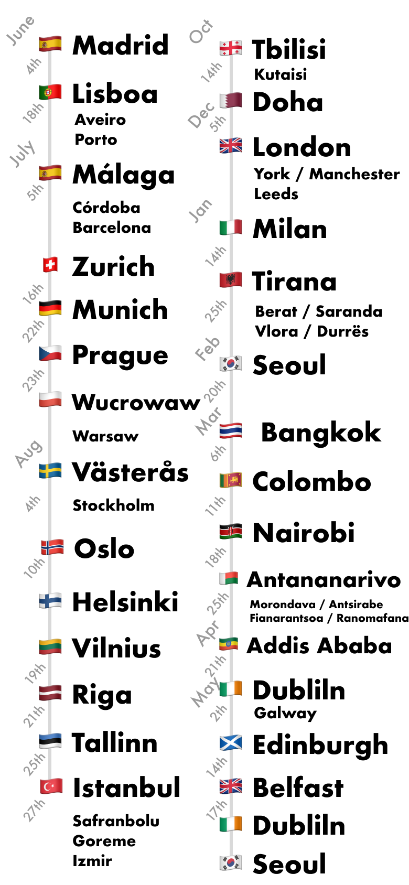

## 大切にしている価値観

### 人生は思い出づくり。

長いようにみえて短い人生で、いかに大切な思い出の一瞬をつくることができるか。

今この瞬間を、一番自分にとって素晴らしい一瞬にできているか。

旅行をしているときの

1日1日を大切にするあの感覚を日常でも持っていたい。

### vision: 思い出の総量をふやす。

- 世の中の人々の思い出の総量(質 x 量)をふやす
    - **質: 喜怒哀楽の深い経験と出会う**
    - **量: (20代で)海外旅行に行く人の数を増やす**

### やるか、やらないか

1. しっかり考えて、行動する
2. 考えずに、行動する
3. 考えただけで、行動しない

上から順番に、結果を出す人だと考えてます。

### 旅行という自分自身の肌で味わう体験

旅行で得られる体験値はなにものにも変えられないもの。

僕を形成する多くの体験は、旅行の中にあったと思います。

### Have been to

43 countries.

- 🇯🇵 Japan
- 🇨🇦 Canada
- 🇺🇸 America
  - NY
  - San Francisco
  - Las Vegas
- 🇹🇼 Taiwan
- 🇹🇭 Thai
- 🇰🇭 Cambodia
- 🇻🇳 Vietnam
- 🇵🇪 Peru
- 🇧🇴 Bolivia
- 🇫🇷 France
- 🇮🇹 Italia
- 🇸🇬 Singapore
- 🇪🇬 Egypt
- 🇲🇦 Morocco
- 🇷🇺 Rossiya
- 🇰🇷 Korea
- 🇨🇳 China
- 🇮🇳 India
- 🇭🇰 HongKong

世界放浪時に訪れた国

